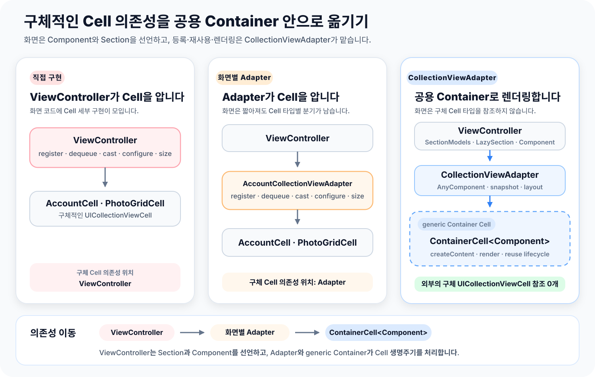
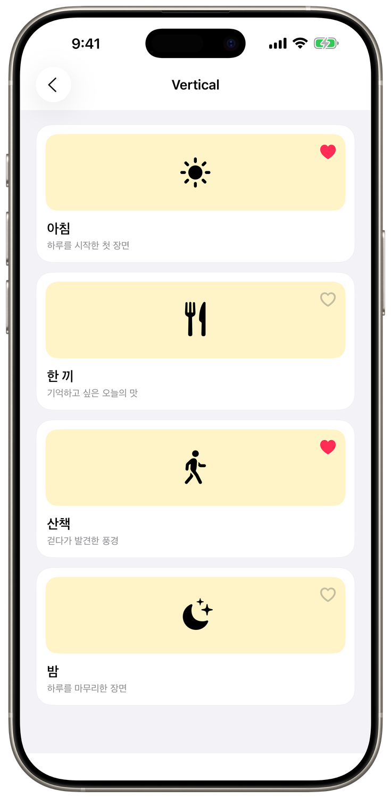
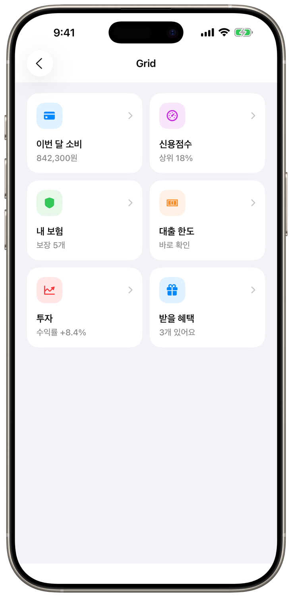
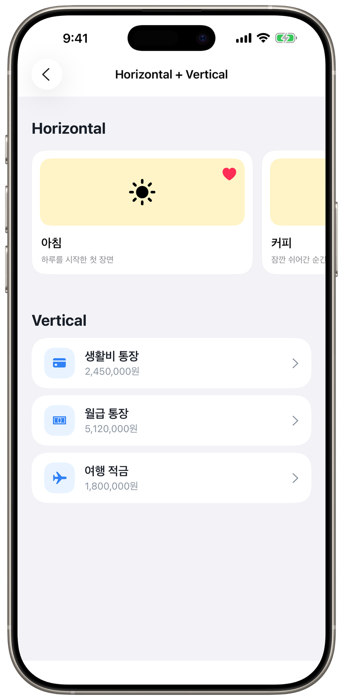
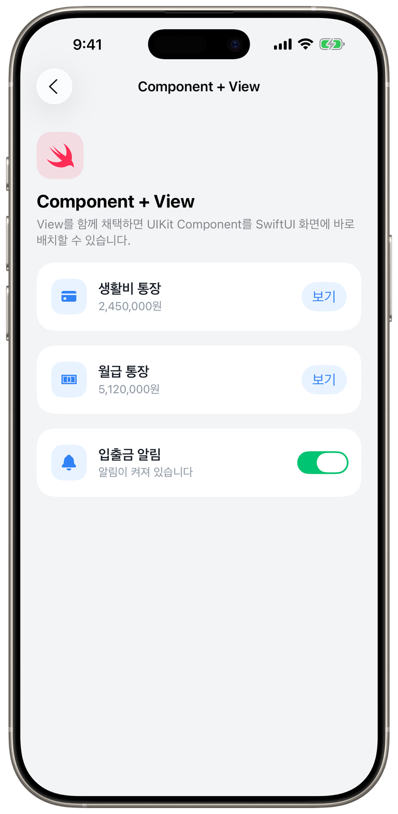

# CollectionViewAdapter

> Collection View의 구조는 선언하고, UIKit의 제어력은 그대로 사용합니다.

CollectionViewAdapter는 `UICollectionView` 화면에서 반복되는 Data Source,
Cell 등록, Section 구성과 Compositional Layout 연결을 하나의 흐름으로
묶은 내부 UI 모듈입니다.

개발자는 `Component`로 Item과 `UIView`를 연결하고,
`SectionModels`로 화면을 선언합니다. Adapter는 이 선언을
Diffable snapshot으로 변환하고, Cell 재사용과 supplementary view,
layout, scroll event를 관리합니다.

## 왜 만들었나요?

### Collection View 화면은 책임이 빠르게 늘어납니다

간단한 목록은 `UICollectionViewDiffableDataSource`만으로도 충분합니다.
하지만 화면에 Header와 Footer, 서로 다른 Section layout, self-sizing,
prefetch와 pagination이 함께 들어오면 ViewController가 알아야 할 것이
많아집니다.

- Cell과 supplementary view를 등록하고 concrete 타입으로 캐스팅합니다.
- 화면 상태를 snapshot과 layout에 각각 반영합니다.
- Item 변경과 재사용 시점에 맞춰 이벤트와 비동기 작업을 다시 연결합니다.
- prefetch의 `IndexPath`를 실제 모델과 연결하고 취소 시점을 관리합니다.
- Section마다 세로 목록, 가로 Carousel, Grid를 별도로 구성합니다.

이 책임이 화면마다 반복되면 같은 연결 코드가 늘고, Item의 identity와
화면 상태를 추적하기 어려워집니다.

### 화면 선언과 UIKit 렌더링을 나눕니다

CollectionViewAdapter에서는 화면 상태를 다음 세 단계로 나눕니다.

1. `Component`가 Item을 어떤 `UIView`로 표시할지 정의합니다.
2. `LazySection`이 Component와 Header, Footer, layout을 묶습니다.
3. `CollectionViewAdapter`가 Section tree를 Collection View에 반영합니다.

ViewController는 concrete `UICollectionViewCell`을 등록하거나
Data Source에서 타입을 분기하지 않습니다. Adapter가 Component 타입에
맞는 generic container를 등록하고, 재사용한 Content에는 최신 Item을
다시 `render`합니다.

### 여러 Collection View에 같은 구성 방식을 적용합니다

CollectionViewAdapter는 UIKit 기반의 여러 Collection View 화면에서
반복되는 등록, Section 구성, layout 연결과 snapshot 갱신을 공용 모듈로
해결합니다.

| 화면 요구사항 | CollectionViewAdapter가 맡는 역할 |
| --- | --- |
| 화면마다 다른 Cell과 supplementary view | `Component` 타입에 맞는 container를 등록하고 재사용합니다. |
| Section마다 다른 목록, Grid와 Carousel | Section DSL과 `CollectionSectionLayout`으로 layout을 함께 선언합니다. |
| 상태 변경에 따른 화면 갱신 | stable identity를 기준으로 diffable snapshot을 생성하고 반영합니다. |
| 여러 화면에서 반복되는 prefetch와 pagination | 모델 식별자 기반 callback과 끝 도달 시점을 일관된 API로 제공합니다. |

각 ViewController는 화면에 필요한 Component와 Section 구조에 집중하고,
Collection View를 연결하는 공통 책임은 Adapter에 맡깁니다.

## 목차

- [지원 사양](#지원-사양)
- [기능 지원표](#기능-지원표)
- [모듈 연결](#모듈-연결)
- [Core 구조](#core-구조)
- [ReadmeCapture](#readmecapture)
  - [Vertical](#vertical)
  - [Grid](#grid)
  - [Horizontal + Vertical](#horizontal--vertical)
  - [Component를 SwiftUI에서 바로 사용하기](#component를-swiftui에서-바로-사용하기)
- [핵심 개념](#핵심-개념)
- [트러블슈팅](#트러블슈팅)
- [Demo 실행하기](#demo-실행하기)
- [디렉터리 구조](#디렉터리-구조)

## 지원 사양

| 항목 | 사양 |
| --- | --- |
| 최소 지원 버전 | iOS 17.0+ |
| UI 프레임워크 | UIKit, SwiftUI |
| 렌더링 기반 | `UICollectionView` |
| 레이아웃 | `UICollectionViewCompositionalLayout` |
| 데이터 갱신 | `UICollectionViewDiffableDataSource` |
| 모듈 구성 | Tuist framework target |

Framework, Tests, Demo target 모두 iOS 17부터 지원합니다.

## 기능 지원표

| 기능 | API | 역할 |
| --- | --- | --- |
| 선언형 Item | `Component` | `Identifiable & Equatable` Item을 `UIView` 생성·렌더링 규칙과 연결합니다. |
| 선언형 Section | `SectionModels`, `LazySection`, `For(of:)` | Section과 Component를 상태에서 선언합니다. |
| Header / Footer | `withHeader`, `withFooter` | 일반 Component를 boundary supplementary view로 재사용합니다. |
| 세로 목록 | `.verticalList` | self-sizing 단일 열 목록을 구성합니다. |
| Grid | `.grid` | 같은 너비의 여러 열을 구성합니다. |
| 가로 목록 | `.horizontalCarousel` | orthogonal scrolling Section을 구성합니다. |
| Custom layout | `CollectionSectionLayout` initializer | `NSCollectionLayoutSection`을 직접 만듭니다. |
| 상태 갱신 | `bind(_:animatingDifferences:)` | Section tree를 새 Diffable snapshot으로 반영합니다. |
| Component 이벤트 | `onTouch`, `pressedEffect`, `onLongPress`, `onButtonTap`, `onToggle` | Content가 채택한 capability에 필요한 동작만 합성합니다. |
| 표시 lifecycle | `willDisplayItem`, `ComponentContext` | 표시 시점과 render 단위 작업 수명을 연결합니다. |
| Prefetch | `prefetchItems`, `cancelPrefetchingItems` | `IndexPath`와 stable Section·Item ID를 함께 전달합니다. |
| 전체 Pagination | `reachedEnd` | Collection View 끝 접근 영역에 들어올 때 알립니다. |
| Section Pagination | `onReachedEnd` | 가로 Carousel Section의 끝 접근을 독립적으로 알립니다. |
| SwiftUI 연결 | `ComponentView`, `ComponentRepresenting` | UIKit Component를 SwiftUI View hierarchy에서 재사용합니다. |

## 모듈 연결

사용할 feature target의 `Project.swift`에
`CollectionViewAdapter` project dependency를 추가합니다.

```swift
dependencies: [
    .project(
        target: "CollectionViewAdapter",
        path: "../../Shared/CollectionViewAdapter"
    ),
]
```

프로젝트를 다시 생성한 뒤 모듈을 import합니다.

```bash
tuist generate
```

```swift
import CollectionViewAdapter
```

## Core 구조

```text
화면 상태
   ↓
SectionModels
└─ LazySection
   ├─ Header / Footer Component
   ├─ Item Component
   └─ CollectionSectionLayout
            ↓
CollectionViewAdapter
├─ UICollectionViewDiffableDataSource
├─ CollectionViewLayoutAdapter
├─ generic ContainerCell<Component>
├─ supplementary provider
└─ delegate · prefetch · scroll callback
            ↓
UICollectionView
```

### Cell 의존성 흐름

화면마다 구체적인 `UICollectionViewCell`을 만들고 연결하는 대신,
ViewController는 Section과 Component를 선언합니다. Adapter는
`AnyComponent`와 snapshot을 관리하고, generic `ContainerCell`이
Component의 `UIView` 생성과 render 생명주기를 처리합니다.

<p align="center">
  
</p>

`Component.Item.ID`는 Diffable Item identity로 사용합니다. 서로 다른
Section에서는 같은 원본 Item ID를 재사용할 수 있도록 Adapter가 내부적으로
Section ID와 Item ID를 함께 묶습니다.

같은 ID의 Item이 새 상태에서 유지되면 `Equatable` 값과 Component 연결
상태를 비교합니다. Content 타입이 같고 표시 값만 달라지면
`reconfigureItems`로 갱신하고, container 타입이 바뀌면 reload합니다.

## ReadmeCapture

Demo 앱의 `ReadmeCapture` Section은 주요 사용 방식을 비교하는 네 가지
예제로 구성됩니다. 앞의 세 화면은 `LazySection`과
`CollectionViewAdapter`로 서로 다른 Section layout을 구성하고, 마지막
화면은 `View`를 채택한 Component를 SwiftUI에서 직접 사용합니다.

### Vertical

가장 단순한 단일 Section 세로 목록입니다. 각 모델을
`AccountRowComponent`로 변환하고 `.verticalList`로 위에서 아래로
배치합니다.

<table>
<tr><th>Source</th><th>Result</th></tr>
<tr>
<td width="65%">

```swift
import CollectionViewAdapter
import UIKit

let sections = SectionModels {
    LazySection(identifier: "accounts") {
        For(of: accounts) { account in
            AccountRowComponent(item: account)
        }
    }
    .withSectionLayout(
        .verticalList(spacing: 10)
    )
}

adapter.bind(sections)
```

</td>
<td width="35%" align="center">



</td>
</tr>
</table>

### Grid

카드 Component를 별도의 Cell subclass 없이 2열 Grid로 배치합니다.
열 수, Item 간격, 행 간격과 바깥 여백은 Section layout이 담당합니다.

<table>
<tr><th>Source</th><th>Result</th></tr>
<tr>
<td width="65%">

```swift
let sections = SectionModels {
    LazySection(identifier: "cards") {
        For(of: cards) { item in
            PhotoCardComponent(item: item)
        }
    }
    .withSectionLayout(
        .grid(
            columns: 2,
            estimatedRowHeight: 178,
            interItemSpacing: 12,
            lineSpacing: 12,
            contentInsets: .init(
                top: 20,
                leading: 20,
                bottom: 24,
                trailing: 20
            )
        )
    )
}

adapter.bind(sections)
```

</td>
<td width="35%" align="center">



</td>
</tr>
</table>

### Horizontal + Vertical

한 Collection View 안에서 Section마다 서로 다른 스크롤 방향을 선언할 수
있습니다. 첫 번째 Section은 가로 Carousel로 움직이고, 두 번째 Section은
일반 세로 목록으로 이어집니다.

<table>
<tr><th>Source</th><th>Result</th></tr>
<tr>
<td width="65%">

```swift
let sections = SectionModels {
    LazySection(identifier: "featured") {
        For(of: featured) { item in
            PhotoCardComponent(item: item)
        }
    }
    .withHeader(
        TitleComponent(title: "Horizontal")
    )
    .withSectionLayout(
        .horizontalCarousel(
            itemWidth: 0.72,
            estimatedHeight: 178,
            spacing: 12,
            behavior: .continuousGroupLeadingBoundary,
            contentInsets: .init(
                top: 8,
                leading: 20,
                bottom: 24,
                trailing: 20
            )
        )
    )

    LazySection(identifier: "accounts") {
        For(of: accounts) { account in
            AccountRowComponent(item: account)
        }
    }
    .withHeader(
        TitleComponent(title: "Vertical")
    )
    .withSectionLayout(
        .verticalList(
            spacing: 10,
            contentInsets: .init(
                top: 8,
                leading: 20,
                bottom: 24,
                trailing: 20
            )
        )
    )
}

adapter.bind(sections)
```

</td>
<td width="35%" align="center">



</td>
</tr>
</table>

Section마다 독립적인 `CollectionSectionLayout`을 가지므로 가로 Section의
orthogonal scrolling과 화면 전체의 세로 스크롤을 한 Adapter에서 함께
처리할 수 있습니다.

### Component를 SwiftUI에서 바로 사용하기

`Component`가 SwiftUI `View`도 함께 채택하면 Component 자체를 SwiftUI
View hierarchy에 바로 배치할 수 있습니다. 모듈이 기본 `body`를 제공하므로
별도의 `ComponentView` wrapper를 호출할 필요가 없습니다.

<table>
<tr><th>Source</th><th>Result</th></tr>
<tr>
<td width="65%">

```swift
import CollectionViewAdapter
import SwiftUI

struct AccountRowComponent:
    Component,
    View
{
    let item: Account

    func createContent() -> AccountContentView {
        AccountContentView()
    }

    func render(
        context: ComponentContext,
        content: AccountContentView
    ) {
        content.configure(with: item)
    }
}

struct AccountStack: View {
    let accounts: [Account]

    var body: some View {
        VStack(spacing: 10) {
            ForEach(accounts) { account in
                AccountRowComponent(item: account)
                    .frame(height: 84)
            }
        }
    }
}
```

</td>
<td width="35%" align="center">



</td>
</tr>
</table>

Collection View에서 사용할 때는 같은 Component를 `LazySection`에 넣고,
SwiftUI에서는 `VStack`, `ForEach` 같은 View 구성 안에 직접 넣습니다.
두 환경 모두 같은 `createContent`와 `render` 계약을 사용합니다.

## 핵심 개념

### Component

`Component`는 Item, Content 생성, render 규칙을 하나로 묶습니다.

```swift
public protocol Component:
    CompositionalLayoutSizeable
{
    associatedtype Item:
        Identifiable & Equatable
    associatedtype Content: UIView

    var item: Item { get }

    @MainActor
    func createContent() -> Content

    @MainActor
    func render(
        context: ComponentContext,
        content: Content
    )
}
```

- `Item.ID`는 snapshot identity입니다.
- `Item.Equatable`은 같은 ID의 화면 상태 변경을 찾는 데 사용합니다.
- `estimatedHeight`는 Compositional Layout의 초기 추정값입니다.
- 실제 높이는 Content의 Auto Layout fitting 결과로 결정합니다.

### ComponentContext

`ComponentContext`는 현재 render의 환경과 수명을 제공합니다.

| 값 | 의미 |
| --- | --- |
| `collectionView` | Component를 표시하는 Collection View |
| `indexPath` | 현재 snapshot에서의 위치 |
| `sectionIdentifier` | Component가 속한 stable Section ID |
| `cancellationBag` | render가 끝날 때 취소할 observation과 작업 |
| `invalidateLayout()` | Content 크기 변경 후 layout 재계산 요청 |

이미지 요청이나 observation처럼 재사용 시 정리해야 하는 작업은
`cancellationBag`에 취소 동작을 저장하세요.

```swift
func render(
    context: ComponentContext,
    content: PhotoContentView
) {
    let task = imageLoader.load(item.imageURL) {
        image in
        content.imageView.image = image
        context.invalidateLayout()
    }

    context.cancellationBag.store {
        task.cancel()
    }
}
```

### SectionModels

`SectionModels`는 Adapter에 한 번에 적용할 화면 상태입니다.

| 타입 | 역할 |
| --- | --- |
| `SectionModels` | 여러 Section을 묶는 최종 Adapter 입력 |
| `LazySection` | bind 시점에 Component를 평가하는 Section |
| `For(of:)` | Collection의 각 값으로 Component를 만드는 반복 표현 |
| `withHeader` / `withFooter` | 일반 Component를 supplementary view로 연결 |
| `withSectionLayout` | Section별 Compositional Layout 지정 |
| `onReachedEnd` | 가로 Carousel Section의 끝 접근 callback 연결 |

Section ID는 화면 안에서 고유해야 합니다. Item ID는 같은 Section 안에서
고유해야 하고, 서로 다른 Section에서는 같은 원본 ID를 사용할 수 있습니다.

### CollectionViewAdapter

Adapter는 다음 책임을 한곳에서 처리합니다.

- Component 타입에 맞는 generic Cell과 supplementary container 등록
- Section tree와 Component 조회 저장소 동기화
- Diffable snapshot 생성과 변경된 기존 Item reconfigure
- Section layout 변경 시 layout invalidation
- Header와 Footer의 container 및 배치 상태 갱신
- delegate, prefetch, 전체·Section별 끝 접근 callback 전달

기본 initializer는 Adapter가 Compositional Layout을 만들고 Collection
View의 기존 layout을 교체합니다.

```swift
let adapter = CollectionViewAdapter(
    collectionView: collectionView,
    interSectionSpacing: 20
)
```

Layout configuration을 직접 제어해야 한다면 같은
`CollectionViewLayoutAdapter` 인스턴스를 layout과 Adapter에 전달합니다.

```swift
let layoutAdapter =
    CollectionViewLayoutAdapter()

let layout =
    UICollectionViewCompositionalLayout(
        sectionProvider:
            layoutAdapter.sectionLayout
    )

collectionView.setCollectionViewLayout(
    layout,
    animated: false
)

let adapter = CollectionViewAdapter(
    collectionView: collectionView,
    layoutAdapter: layoutAdapter
)
```

## 트러블슈팅

### 중복 identifier precondition이 발생합니다

Section ID는 전체 화면에서 고유해야 하고, Item ID는 같은 Section 안에서
고유해야 합니다.

```text
중복 section identifier: accounts
section accounts의 중복 item ID: daily
```

배열 index나 임의의 새 UUID 대신 모델의 stable identity를 사용하세요.

### Item 값이 바뀌었는데 화면이 갱신되지 않습니다

다음을 확인하세요.

1. 변경 전후 Item ID가 같은지 확인합니다.
2. 화면에 표시할 값이 Item의 `Equatable` 비교에 포함되는지 확인합니다.
3. 상태를 바꾼 뒤 새 `SectionModels`로 `adapter.bind`를 호출했는지
   확인합니다.

Item ID까지 바꾸면 기존 Item의 content update가 아니라 delete와 insert로
처리됩니다.

### self-sizing 높이가 맞지 않습니다

Content 내부에 위에서 아래까지 이어지는 Auto Layout 제약이 있어야 합니다.
`estimatedHeight`는 실제 고정 높이가 아니라 최초 layout 계산을 위한
추정값입니다.

비동기 이미지처럼 표시 후 높이가 바뀌면
`context.invalidateLayout()`을 호출하세요.

### Header를 추가했지만 스크롤에 고정되지 않습니다

Header UI와 고정 동작은 별도 설정입니다.

```swift
LazySection(identifier: "feed") {
    // Items
}
.withHeader(headerComponent)
.withSectionLayout(
    CollectionSectionLayout
        .verticalList()
        .withHeaderPinToVisibleBounds(true)
)
```

### 가로 Section의 `onReachedEnd`에서 precondition이 발생합니다

Section 단위 끝 접근 감지는 기본 제공
`.horizontalCarousel`에서 지원합니다. custom layout이나 세로 목록의
전체 pagination은 Adapter의 `reachedEnd`를 사용하세요.

### 재사용 후 이벤트가 여러 번 실행됩니다

Component modifier가 아닌 직접 observation을 만들었다면 취소 동작을
`ComponentContext.cancellationBag`에 저장했는지 확인하세요. Adapter는
새 render와 display 종료 시 context를 취소합니다.

## Demo 실행하기

저장소 루트에서 프로젝트를 생성한 뒤
`CollectionViewAdapterDemo` scheme을 실행합니다.

```bash
tuist generate
open Haruhancut.xcworkspace
```

Demo 앱의 **ReadmeCapture** Section에서 README와 같은 순서로 다음
화면을 확인할 수 있습니다.

1. Vertical
2. Grid
3. Horizontal + Vertical
4. Component + View

캡처 화면을 직접 실행하려면 scheme arguments에 예제 slug를 전달합니다.

```text
--readme-capture vertical
--readme-capture grid
--readme-capture mixed-sections
--readme-capture swiftui-component
```

## 디렉터리 구조

```text
CollectionViewAdapter
├─ Sources
│  └─ Collection
│     ├─ Adapter
│     ├─ CompositionalLayout
│     ├─ Modifier
│     ├─ Section
│     ├─ SwiftUI
│     ├─ Component.swift
│     ├─ ComponentContext.swift
│     ├─ AnyComponent.swift
│     ├─ ContainerCell.swift
│     └─ ContainerSupplementaryView.swift
├─ Tests
│  └─ Sources
├─ Demo
│  ├─ 0. App
│  ├─ 1. Basic
│  ├─ 2. Adapter
│  ├─ 2. Component
│  ├─ 3. SwiftUI
│  └─ 4. ReadmeCapture
├─ docs
│  └─ images
│     └─ readme
└─ Project.swift
```
