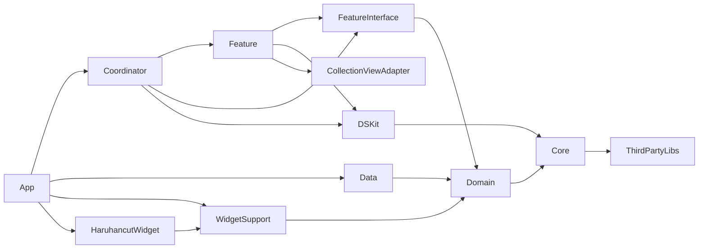

# Haruhancut UIKit 아키텍처

> 하루한컷은 Tuist로 나눈 **모듈형 UIKit 앱**이에요. 기능(Feature) 모듈은 Interface 모듈을 통해 Domain에 의존하고, 화면 전환은 별도의 Coordinator 모듈이 맡아요. 이 문서는 `Workspace.swift`, 각 `Project.swift`, `Tuist/Package.swift`와 소스 코드를 확인해 작성했어요.

## 목차

- [아키텍처 개요](#아키텍처-개요)
- [모듈 구성](#모듈-구성)
- [계층별 책임](#계층별-책임)
- [의존성 방향과 데이터 흐름](#의존성-방향과-데이터-흐름)
- [주요 패턴과 사용 기술](#주요-패턴과-사용-기술)
- [현재 구조의 예외](#현재-구조의-예외)
- [새 기능 개발 체크리스트](#새-기능-개발-체크리스트)
- [관련 문서](#관련-문서)

## 아키텍처 개요

```text
Projects/
├── App/                    앱 타깃(Haruhancut), AppDelegate·SceneDelegate, 의존성 등록, FCM
├── Coordinator/            AppCoordinator와 기능별 Coordinator (화면 전환)
├── Features/<X>Feature/    화면 모듈. Sources · Interface · Demo · Tests · Testing
├── Domain/                 Entity, Repository 프로토콜, Usecase 프로토콜과 구현
├── Data/                   Firebase·Kakao·Apple Manager, DTO, Repository 구현
├── Core/                   DIContainer, Session, ViewModelType, Logger, 확장
├── Shared/                 DSKit, CollectionViewAdapter, ThirdPartyLibs, WidgetSupport, RxLab, Configs
└── Widget/HaruhancutWidget 위젯 확장
```

| 계층 | 맡는 일 | 넣지 않을 일 |
| --- | --- | --- |
| App | 구현체를 만들어 `DIContainer`에 등록하고, `SceneDelegate`에서 `AppCoordinator`를 시작해요. FCM·APNs delegate를 처리해요. | 화면 생성이나 비즈니스 규칙을 넣지 않아요. |
| Coordinator | 세션 상태로 첫 흐름을 정하고, Feature Builder로 화면을 만들어 push·present해요. 화면의 `RouteTrigger`를 채택해 이동을 처리해요. | Reactor·ViewModel 로직이나 데이터 요청을 넣지 않아요. |
| Feature | View, ViewController, Reactor(새 화면 기본) 또는 기존 ViewModel, Builder를 둬요. 화면 상태를 만들고 표시해요. | Repository나 Firebase Manager를 직접 호출하지 않아요. |
| Feature Interface | Coordinator가 사용할 `Presentable` 타입과 `RouteTrigger` 프로토콜을 공개해요. | Reactor·ViewModel 구현 타입을 노출하지 않아요. |
| Domain | Entity, Repository 프로토콜, Usecase를 정의해요. | Firebase SDK와 DTO를 참조하지 않아요. |
| Data | Domain의 Repository 프로토콜을 구현하고, Firebase·Kakao·Apple 로그인 SDK를 감싸요. DTO를 Entity로 바꿔요. | 화면 상태를 다루지 않아요. |
| Core | 모든 계층이 쓰는 DI, 세션 저장, 공통 프로토콜과 확장을 둬요. | 특정 기능의 규칙을 넣지 않아요. |
| Shared | 디자인 시스템(DSKit), 컬렉션 뷰 어댑터, 외부 라이브러리 묶음, 위젯 공유 저장소를 둬요. | 특정 화면에만 쓰는 UI를 미리 올리지 않아요. |

## 모듈 구성

`Workspace.swift`에는 App, `Widget/*`, Coordinator, `Features/*`, Domain, Core, `Shared/*`가 등록돼 있어요. Data는 목록에 없지만 App·Feature가 의존해서 함께 생성돼요. `Tuist/ProjectDescriptionHelpers`는 없고 모든 `Project.swift`를 직접 작성해요.

### 공통·기반 모듈

| 모듈 | 제품 형태 | 의존 모듈 | 테스트·데모 |
| --- | --- | --- | --- |
| `App` (`productName: Haruhancut`) | app | Coordinator, Data, ThirdPartyLibs, WidgetSupport, HaruhancutWidget | `AppTests`, `AppUITests` |
| `Coordinator` | staticFramework | 모든 Feature(+Interface), DSKit, Core, ThirdPartyLibs | 없음 |
| `Domain` | framework | Core | 테스트 타깃 주석 처리 |
| `Data` | framework | Domain, ThirdPartyLibs | `DataTests` |
| `Core` | framework | ThirdPartyLibs | `CoreTests` |
| `Shared/ThirdPartyLibs` | framework | 외부 패키지(RxCocoa, RxDataSources, ReactorKit, RxKakaoSDK, Firebase, Kingfisher, Lottie, ScaleKit, FSCalendar 등) | 없음 |
| `Shared/DSKit` | framework (리소스 포함) | Core, ThirdPartyLibs | `DSKitTests`, `DSKitDemo` |
| `Shared/CollectionViewAdapter` | framework | 없음 | Tests, Demo |
| `Shared/WidgetSupport` | staticFramework | Domain | 없음 |
| `Shared/RxLab` | framework | 학습용 샌드박스. 예제는 Demo에만 있어요. | Tests, Demo |
| `Widget/HaruhancutWidget` | appExtension | WidgetSupport | 없음 |

`Shared/Configs/Shared.xcconfig`는 App과 Demo 앱이 함께 쓰는 설정이에요. `.gitignore` 대상이며 CI는 secret으로 생성해요.

### Feature 모듈

화면 패턴은 **ReactorKit이 기본 규칙**이에요. 아래 표의 MVVM(Input/Output) 화면은 유지하다가 한 화면씩 ReactorKit으로 전환해요. 기준과 절차는 [View·Reactor·ViewModel 계약](view-viewmodel-protocols.md)을 확인해요.

모든 Feature는 `Projects/Features/<X>Feature/` 아래에 `Sources`, `Interface`, `Demo`, `Tests`, `Testing` 폴더를 둬요. 본 타깃은 `staticFramework`, Interface 타깃은 `framework`예요.

| Feature | 화면 패턴 | 추가 의존 모듈 | 활성 테스트 타깃 |
| --- | --- | --- | --- |
| `AuthFeature` | MVVM (전환 대상) | DSKit, ThirdPartyLibs | 없음 |
| `OnboardingFeature` | 빈 Input/Output + 클로저 | DSKit, ThirdPartyLibs | 없음 |
| `ImageFeature` | MVVM (전환 대상) | DSKit, ThirdPartyLibs | 없음 |
| `HomeFeatureV2` | ReactorKit(피드·캘린더 탭, 기준 구현) + MVVM(FeedDetail·CalendarDetail·Comment, 전환 대상). `HomeViewController`는 두 Reactor를 묶는 컨테이너 | CollectionViewAdapter, DSKit, Data, ThirdPartyLibs, WidgetSupport | `HomeFeatureV2Tests` |
| `ProfileFeatureV2` | MVVM (전환 대상) | CollectionViewAdapter, DSKit, Core, Domain, ThirdPartyLibs | `ProfileFeatureV2Tests` |
| `MemberFeatureV2` | MVVM (전환 대상) | CollectionViewAdapter, DSKit, Core, Domain, ThirdPartyLibs | `MemberFeatureV2Tests` |
| `AdminFeature` | MVVM (전환 대상) | CollectionViewAdapter, DSKit, Core, Domain, ThirdPartyLibs | `AdminFeatureTests` |
| `HomeFeature` (V1) | MVVM. `HomeViewModel` Output 하나를 Feed·Calendar 자식 VC가 공유 | DSKit, Data, ThirdPartyLibs, WidgetSupport | 없음 |
| `ProfileFeature`, `MemberFeature` (V1) | MVVM | DSKit, ThirdPartyLibs | 없음 |

화면별 패턴 분류는 [View·Reactor·ViewModel 계약의 화면별 패턴 현황](view-viewmodel-protocols.md#화면별-패턴-현황)을 확인해요. 현재 앱의 홈·프로필·멤버 흐름은 V2 모듈을 사용해요. `AppCoordinator` → `HomeV2Coordinator` → `MemberCoordinatorV2` / `ProfileCoordinatorV2` / `AdminCoordinator` / `CameraCoordinator` 순서로 연결돼요. V1 모듈은 [현재 구조의 예외](#현재-구조의-예외)를 확인해요.

## 계층별 책임

### App: 의존성 등록과 앱 시작

- `AppDelegate.swift`의 `didFinishLaunching`에서 `registerDependencies()`를 호출한 뒤 `FirebaseApp.configure()`를 실행해요. Manager가 Firebase에 지연 접근하므로 이 순서로 동작해요.
- `AppDelegate+Dependency.swift`의 `registerDependencies()`가 Session → Manager → Repository → Usecase 순서로 객체를 만들고 필요한 것만 `DIContainer.shared`에 등록해요. 자세한 내용은 [DI Container](dicontainer.md)를 확인해요.
- `SceneDelegate.swift`가 `UINavigationController`를 window root로 두고 `AppCoordinator(navigationController:)`를 시작해요. DEBUG 빌드에서 `-UITest` launch argument가 있으면 `SceneDelegate+UITests.swift`가 테스트 세션을 먼저 준비해요.
- `AppDelegate+FCM.swift`가 APNs·FCM delegate와 포그라운드 알림 표시를 처리하고 `syncFcmIfNeeded()`를 호출해요.

### Coordinator: 화면 흐름

- `Coordinator` 프로토콜(`Coordinator/Sources/App/AppCoordinator.swift`)은 `parentCoordinator`, `childCoordinators`, `start()`를 가지며 `childDidFinish(_:)`를 기본 구현으로 제공해요.
- `AppCoordinator.routeBySession()`은 온보딩 완료 여부(`UserDefaults "Tutorial"`) → 로그인 세션·`Auth.auth().currentUser` → 그룹 세션 순서로 확인해 Onboarding·Auth·Group·Home 흐름 중 하나를 시작해요. `userSession`이 바뀔 때마다 다시 판단해요.
- ReactorKit 화면(기본): Coordinator가 `XxxRouteTrigger`를 채택하고 `makeXxx(routeTrigger: self)`로 ViewController를 받아요. `HomeV2Coordinator`와 `AdminCoordinator`가 이 방식이에요.
- 기존 Input/Output 화면: `XFeatureBuilder().makeX()`로 `(vc, vm)`을 받고, `vm`의 RouteTrigger 클로저(예: `onSignInSuccess`)에 다음 흐름을 연결해요.

### Feature: 화면과 화면 상태

- `Sources/<Screen>/`에 ViewController, 루트 View, Reactor(기존 화면은 ViewModel)를 함께 둬요. `Sources/Builder` 또는 `Sources/Factory`에 `XFeatureBuilder`를 둬요.
- Builder는 `public protocol XFeatureBuildable`을 채택한 `public final class`이고, `@Dependency`로 Usecase·Session을 꺼내 Reactor(또는 ViewModel)·ViewController 생성자에 넘겨요.
- Interface 모듈은 ReactorKit 화면이면 `HomeRouteTrigger: AnyObject`와 `HomePresentable = UIViewController`를, 기존 Input/Output 화면이면 `SignInRouteTrigger`와 `SignInPresentable = (vc:, vm: any SignInViewModelType)`을 공개해요. 자세한 내용은 [View·Reactor·ViewModel 계약](view-viewmodel-protocols.md)을 확인해요.
- Demo 앱은 Demo용 Usecase와 메모리 Session을 `DIContainer`에 등록해 Feature를 단독으로 실행해요. (예: `HomeFeatureV2/Demo/Sources/DemoDependencies.swift`)

### Domain: 비즈니스 규칙과 계약

- `Domain/Sources/Entity/`: `User`, `HCGroup`, `Post`, `Comment`, `AdminGroupSummary` 등. `UserSession = SessionContext<User>`, `GroupSession = SessionContext<SessionGroup>` 타입 별칭도 여기에 있어요.
- `Domain/Sources/RepositoryProtocol/`: `AuthRepositoryProtocol`, `GroupRepositoryProtocol`, `AdminRepositoryProtocol`
- `Domain/Sources/Usecase/`: 한 파일에 프로토콜과 구현을 함께 둬요. (`AuthUsecaseProtocol`·`AuthUsecaseImpl`, `GroupUsecaseProtocol`·`GroupUsecaseImpl`, `AdminUsecaseProtocol`·`AdminUsecaseImpl`)
- Usecase는 Repository와 Session을 생성자로 받고, RxSwift `Single`·`Observable`을 반환해요.

### Data: 계약 구현과 외부 SDK

- `Data/Sources/*Manager.swift`: `FirebaseAuthManager`(Realtime Database CRUD·그룹·FCM·observe), `FirebaseStorageManager`, `KakaoLoginManager`, `AppleLoginManager`. 각 Manager는 자신의 프로토콜을 함께 정의해요.
- `Data/Sources/Dto/`: `UserDTO`, `HCGroupDTO`, `PostDTO`, `CommentDTO`와 `toModel()`·`toDTO()` 변환. 읽기 결과의 `toModel()`은 주로 `FirebaseAuthManager`에서 호출해요.
- `Data/Sources/RepositoryImpl/`: `AuthRepositoryImpl`, `GroupRepositoryImpl`, `AdminRepositoryImpl`
- 별도의 Infrastructure 계층은 없어요. 외부 SDK 래퍼는 Data에, UserDefaults 저장소는 Core의 `Session/Storage`에 있어요.

### Core와 Shared

- Core: `DIContainer`·`@Dependency`, `SessionContext<Model>`·`UserDefaultsStorage`, `ViewModelType`, `RefreshableViewController`, `Logger`, `Constants`, `UITestID`, `Extensions+/`
- DSKit: 공통 UI 컴포넌트, 색상·폰트 리소스, `ImagePreViewController` 등
- CollectionViewAdapter: 외부 의존성 없이 `UICollectionView`의 섹션·셀 구성을 선언형으로 다루는 사내 모듈이에요. V2 Feature와 AdminFeature가 사용해요. 화면에서 쓰는 방법은 [화면 그리기](view-rendering.md)를 확인해요.
- ThirdPartyLibs: 외부 패키지를 한곳에서 링크하는 모듈이에요. 소스의 `@_exported import`는 주석 처리돼 있어 각 파일에서 필요한 라이브러리를 직접 import해요.
- WidgetSupport: 앱과 위젯이 공유하는 `WidgetSessionStore`, `WidgetPhotoStore`, `WidgetPaths`. 앱에서는 `HomeFeatureV2`의 `FeedWidgetSynchronizer`가 그룹을 불러오거나 게시물을 지울 때 위젯용 사용자와 오늘 사진을 저장·삭제하고, 위젯(`PhotoWidget`)이 이를 읽어요. 관리자 미리보기(`adminPreview`)에서는 동기화하지 않아요.

## 의존성 방향과 데이터 흐름

### 코드가 참조하는 방향



| 사용하는 쪽 | 참조할 수 있는 모듈 | 참조하지 않을 모듈 |
| --- | --- | --- |
| Domain | Core (Core를 거쳐 RxSwift) | Data, Feature, Coordinator, App |
| Feature | 자신의 Interface, Domain, Core, DSKit, CollectionViewAdapter, ThirdPartyLibs | 다른 Feature, Coordinator, App. Data는 새로 추가하지 않아요. |
| Feature Interface | Domain (V2·Admin은 Core도) | Feature 구현, Data |
| Data | Domain, ThirdPartyLibs | Feature, Coordinator |
| Coordinator | Feature와 Interface, DSKit, Core | Data |
| App | 조립에 필요한 모든 모듈 | 다른 모듈이 App을 참조하지 않아요. |

Repository 프로토콜은 Domain에, 구현은 Data에 있어요. Feature는 `AuthUsecaseProtocol` 같은 Domain 프로토콜만 알고, 구현체는 App이 등록해요.

### 화면에서 데이터까지: 오늘 피드 조회

1. `HomeV2Coordinator`가 `HomeFeatureBuilder().makeHome(mode:routeTrigger:)`로 `HomeViewController`를 만들어요. Builder는 `GroupUsecaseProtocol`을 resolve하고, `HomeGroupLoaderFactory`로 모드별 그룹 조회 클로저(`loadGroup`)를 만들어 `FeedReactor`와 `CalendarReactor`에 넘겨요. `.currentGroup`은 `groupUsecase.loadAndFetchGroup()`, `.adminPreview(groupID:)`는 `AdminUsecaseProtocol.fetchGroup(groupId:)`를 사용해요.
2. `HomeViewController`에 들어 있는 `FeedViewController`가 `viewDidLoad`에서 `reactor?.action.onNext(.viewDidLoad)`를 보내요.
3. `FeedReactor.mutate`는 `loadFeed()`에서 `loadGroup`을 호출하고, 결과를 `setFeed(components, didTodayUpload)` Mutation으로 바꿔 State의 `components`와 `didTodayUpload`를 갱신해요. 읽기 전용 모드에서는 `groupUsecase`를 `nil`로 받아 삭제를 막아요.
4. `GroupUsecaseImpl.loadAndFetchGroup()`은 `GroupSession`에 캐시된 그룹을 먼저 방출하고, `GroupRepositoryProtocol.fetchGroup(groupId:)`의 서버 결과를 이어서 방출해요. 서버 결과는 `GroupSession`에 다시 저장해요.
5. `GroupRepositoryImpl`은 `FirebaseAuthManager`에 요청을 위임해요. `FirebaseAuthManager`가 Realtime Database를 읽고 DTO를 `toModel()`로 Entity로 바꿔 돌려줘요. 쓰기 요청은 Repository가 `toDTO()`로 변환해 넘겨요.
6. `FeedViewController`와 `HomeViewController`는 Reactor State를 구독해 피드 목록과 오늘 업로드 문구·카메라 버튼 상태를 갱신해요.

위 순서는 호출 방향이에요. 응답은 반대로 돌아오지만 Domain이 Data를 import하지는 않아요.

## 주요 패턴과 사용 기술

| 패턴 | 적용 위치 | 확인할 파일 |
| --- | --- | --- |
| ReactorKit (**기본 규칙**) | `HomeFeatureV2`의 Feed·Calendar 탭 (컨테이너는 `HomeViewController`), 새 화면 | `FeedReactor.swift`, `CalendarReactor.swift`, `HomeViewController.swift` |
| MVVM + Input/Output (유지·전환 대상) | 나머지 Feature 화면 | `Core/Sources/ViewModelType.swift`, 각 `*ViewModel.swift` |
| Builder + Presentable | 모든 Feature | `*FeatureBuilder.swift`, `Interface/Sources/**/*Presentable.swift` |
| Coordinator | Coordinator 모듈 | `AppCoordinator.swift`, `HomeV2Coordinator.swift` |
| Service Locator DI | App 등록, Builder·일부 Reactor·ViewModel·Coordinator resolve | `DIContainer.swift`, `AppDelegate+Dependency.swift` |
| Repository | Domain 프로토콜, Data 구현 | `RepositoryProtocol/`, `RepositoryImpl/` |
| Session | 로그인 사용자·그룹 상태 저장과 관찰 | `Core/Sources/Session/Session.swift` |

### 외부 라이브러리

버전은 `Tuist/Package.swift`의 하한 버전이에요. 실제 고정 버전은 `Tuist/Package.resolved`를 확인해요.

| 라이브러리 | 용도 |
| --- | --- |
| RxSwift 6.10.2 (RxCocoa, RxRelay, RxBlocking, RxTest) | 비동기 흐름, UI 바인딩, 테스트 |
| ReactorKit 3.2.0 | 화면 상태 관리의 기본 규칙 (현재 HomeFeatureV2 피드·캘린더) |
| RxDataSources 5.0.0 | 컬렉션·테이블 데이터 소스 |
| firebase-ios-sdk 11.14.0 | Auth, Realtime Database, Storage, Messaging |
| kakao-ios-sdk, kakao-ios-sdk-rx 2.27.3 | 카카오 로그인 |
| Kingfisher 8.12.0 | 이미지 다운로드·캐시 |
| FSCalendar 2.8.4 | 캘린더 화면 |
| Lottie 4.6.1, ScaleKit 1.1.3 | 애니메이션, 화면 크기 대응 |
| TurboListKit, CarbonListKit, DifferenceKit | 링크돼 있지만 Demo 외 소스에서는 import하지 않아요. |

SnapKit, Then, GRDB는 사용하지 않아요. 레이아웃은 Auto Layout 코드로 작성해요. 자세한 기준은 [Swift 스타일](../development/swiftstyle.md)을 확인해요.

## 현재 구조의 예외

새 코드에서 따라 하지 않을 부분이에요. 정리 작업은 별도 이슈로 진행해요.

| 예외 | 위치 | 새 코드의 기준 |
| --- | --- | --- |
| Domain이 `UIKit`을 import하고 `UIImage`를 API에 사용해요. | `AuthRepositoryProtocol.swift`, `AuthUsecase.swift` 등 | 새 Domain API에는 UIKit 타입을 추가하지 않아요. |
| HomeFeatureV2가 Data·WidgetSupport를 의존 목록에 두지만 import하지 않아요. | `HomeFeatureV2/Project.swift` | Feature에 Data 의존을 새로 추가하지 않아요. |
| 위젯 사진 동기화(`WidgetPhotoStore`, `WidgetSessionStore`)가 V1 `HomeViewModel`에만 있어요. App은 V1 HomeFeature를 링크하지 않아요. | `HomeFeature/Sources/Home/HomeViewModel.swift` | V2 흐름(App·Coordinator·HomeFeatureV2)에는 위젯 저장소를 쓰는 코드가 없어요. 위젯 사진이 갱신되지 않을 수 있어요. (확인 필요: 실기기 위젯 동작) |
| V1 `ProfileCoordinator`, `MemberCoordinator`는 컴파일되지만 생성되지 않고, `HomeCoordinator`는 전체 주석 처리돼 있어요. | `Coordinator/Sources` | 새 흐름은 V2 Coordinator에 추가해요. |
| `AppCoordinator`가 `FirebaseAuth`를 직접 import해 `Auth.auth().currentUser`를 확인해요. | `AppCoordinator.swift` | 새 Coordinator에서 Firebase를 직접 호출하지 않아요. |
| `MemberCoordinatorV2`, `ProfileCoordinatorV2`가 `childDidFinish`를 호출하지 않아요. | `Coordinator/Sources` | 새 Coordinator는 흐름이 끝나면 `childDidFinish(self)`를 호출해요. |
| `Data/Sources/UserDefaultsManager.swift`와 Core의 `UserSessionLegacy*.swift`는 사용하지 않는 코드예요. | Data, Core | 새 코드에서 참조하지 않아요. |
| `Shared/Fetcher`는 `refactor/#94` 브랜치(Draft PR #95)에서 진행 중이며 `main`에는 모듈이 없어요. | `Projects/Shared/Fetcher` | 병합 후 이 문서를 갱신해요. |

## 새 기능 개발 체크리스트

### 1. 모듈을 만들어요

- [ ] `make feature <이름>`(접미사 없음) 또는 `make feature name=<이름>`(`Feature` 접미사 추가)으로 Tuist scaffold를 실행해요.
- [ ] 생성된 `Project.swift`를 기존 V2 Feature에 맞춰 고쳐요. 본 타깃은 `staticFramework`, 의존성은 Interface·DSKit·Core·Domain·ThirdPartyLibs(필요하면 CollectionViewAdapter)를 추가해요.
- [ ] `Coordinator/Project.swift`에 새 Feature와 Interface 의존성을 추가하고 `tuist generate --no-open`으로 확인해요.

### 2. Domain을 정의해요

- [ ] Entity와 Repository 프로토콜을 Domain에 추가해요.
- [ ] 기존 Usecase에 맞는 기능이면 그 프로토콜을 확장하고, 새 영역이면 `<X>UsecaseProtocol`·`<X>UsecaseImpl`을 한 파일에 추가해요.

### 3. Data를 연결해요

- [ ] Data에 `<X>RepositoryImpl`과 필요한 DTO(`toModel()`·`toDTO()`)를 추가해요. Firebase 접근은 Manager를 통하고, Feature에는 DTO를 노출하지 않아요.
- [ ] `AppDelegate+Dependency.swift`에서 구현체를 만들고 Usecase 프로토콜로 `register`해요.

### 4. Feature를 만들어요

- [ ] Interface에 `<X>RouteTrigger: AnyObject`와 `<X>Presentable = UIViewController`를 정의해요.
- [ ] `<X>Reactor`(Action·Mutation·State), ReactorKit `View`를 채택한 `<X>ViewController`, 루트 View를 만들어요. Input/Output ViewModel은 새로 만들지 않아요.
- [ ] `<X>FeatureBuilder`에서 `@Dependency`로 의존성을 꺼내 Reactor 생성자로 주입하고, `routeTrigger`를 ViewController에 설정해요.
- [ ] Demo 앱에서 Demo용 Usecase를 등록해 단독 실행을 확인해요.

### 5. 흐름을 연결하고 검증해요

- [ ] Coordinator가 `<X>RouteTrigger`를 채택하고 `makeX(routeTrigger: self)`로 화면을 만든 뒤, `onXxx` 클로저에 이동을 연결해요.
- [ ] Usecase·Reactor 테스트를 `<X>Tests` 타깃에 추가해요. CI는 App·Core·Data 스킴만 실행하므로 Feature 테스트는 로컬에서 실행하고 PR에 결과를 적어요. 실행 방법은 [테스트](../development/testing.md)를 확인해요.
- [ ] 모듈 구성이 바뀌면 이 문서의 모듈 표를 갱신해요.

## 관련 문서

- [화면 그리기](view-rendering.md): CollectionViewAdapter로 목록을 그리는 방법
- [DI Container](dicontainer.md): 등록 위치, `@Dependency` 사용처, Demo·테스트에서의 교체
- [View·Reactor·ViewModel 계약](view-viewmodel-protocols.md): ReactorKit 기본 규칙, Presentable, RouteTrigger, Input/Output 전환 절차
- [RxSwift 사용 기준](rxswift.md), [바인딩 정책](rxswift-binding-policy.md), [Input/Output 패턴](rxswift-input-output.md)
- [테스트](../development/testing.md): 테스트 타깃과 실행 명령
