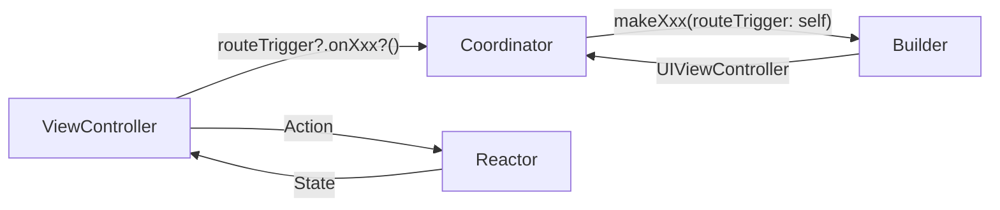

# Haruhancut UIKit View·Reactor·ViewModel 계약

> **새 화면은 ReactorKit으로 작성해요.** 지금 Input/Output(`ViewModelType`)을 쓰는 화면은 그대로 유지하고, 해당 화면을 크게 수정할 때 한 화면씩 ReactorKit으로 전환해요.

| 구분 | 규칙 |
| --- | --- |
| 새 화면 | ReactorKit (`XxxReactor: Reactor` + `XxxViewController: UIViewController, View`) |
| 기존 Input/Output 화면 | 유지해요. 버그 수정·작은 변경은 기존 구조 안에서 해요. |
| 전환 시점 | 화면의 상태·이벤트를 크게 바꾸는 작업을 할 때, 한 화면씩 `🔨 refactor` 이슈로 전환해요. |
| 애매한 기존 코드 | 규칙과 어긋나거나 기준이 없는 코드는 한꺼번에 고치지 않고, 그 파일을 수정할 때 조금씩 현재 틀에 맞춰요. ([기존 코드를 현재 틀에 맞춰요](#기존-코드를-현재-틀에-맞춰요)) |
| 섞어 쓰기 | 한 ViewController 안에 ViewModel과 Reactor를 함께 두지 않아요. 여러 자식 화면을 묶는 컨테이너만 예외예요. |

## 목차

- [화면별 패턴 현황](#화면별-패턴-현황)
- [ReactorKit 화면 구조](#reactorkit-화면-구조)
- [컨테이너 화면](#컨테이너-화면)
- [구독 수명](#구독-수명)
- [기존 Input/Output 화면](#기존-inputoutput-화면)
- [기존 코드를 현재 틀에 맞춰요](#기존-코드를-현재-틀에-맞춰요)
- [Input/Output에서 ReactorKit으로 전환해요](#inputoutput에서-reactorkit으로-전환해요)

## 화면별 패턴 현황

`Projects/*/Sources`의 모든 ViewController를 분류한 결과예요. (Demo 제외, `main` 기준. 열린 브랜치 `refactor/#94`, `feature/#83`도 같아요.)

| 패턴 | 화면 | 전환 계획 |
| --- | --- | --- |
| **ReactorKit** | HomeFeatureV2 `FeedViewController`(`FeedReactor`), `CalendarViewController`(`CalendarReactor`) | 기준 구현이에요. |
| **ReactorKit 컨테이너** | HomeFeatureV2 `HomeViewController` | 두 Reactor를 묶는 컨테이너예요. [컨테이너 화면](#컨테이너-화면) 참고 |
| **Input/Output** | Auth(SignIn, SignUp, Group), Image(Camera, ImageUpload), ProfileFeatureV2(Profile, Setting, NicknameEdit, BirthdayEdit), MemberFeatureV2, Admin, HomeFeatureV2 FeedDetail·CalendarDetail | 유지 → 순차 전환 |
| **Input/Output (`ViewModelType` 미채택)** | V1·V2 `CommentViewModel` | 유지 → 순차 전환. `FeedDetailBuilder`·`CalendarDetailBuilder`의 `makeComment`가 ViewController만 반환해요. |
| **공유 Output** | V1 HomeFeature `HomeViewController` → `FeedViewController`·`CalendarViewController` | V1은 앱에서 쓰지 않으므로 전환하지 않아요. |
| **빈 계약 + 클로저** | `OnboardingViewController` (`Input {}`·`Output {}`이 비어 있음) | 상태가 생기면 ReactorKit으로 전환해요. |
| **패턴 없음** | DSKit `ImagePreViewController`, Onboarding `PageContentsViewController`, App `MainViewController` | 표시 전용 화면이라 그대로 둬요. |

### ReactorKit을 도입한 경위

| 시점 | 커밋 | 변화 |
| --- | --- | --- |
| 2026-04-19 | `2da8334` | ReactorKit 의존성 추가 |
| 2026-04-22 | `fa91efa` (PR #46) | HomeFeatureV2에 `HomeReactor`, `FeedReactor`, `CalendarReactor` 도입. 당시 `HomeReactor`는 RouteTrigger 클로저를 가진 Reactor였고 Action이 비어 있었어요. |
| 2026-07-27 | `552f3f8` | HomeFeatureV3(CollectionViewAdapter 적용판)를 HomeFeatureV2로 승격. `HomeReactor`를 지우고 화면 이동을 `HomeRouteTrigger`로 옮겼어요. |
| 2026-07 | ProfileFeatureV2, MemberFeatureV2, AdminFeature | 이 시기의 화면은 Input/Output으로 작성했어요. 앞으로 전환 대상이에요. |

## ReactorKit 화면 구조

기준 구현은 HomeFeatureV2의 `FeedReactor`·`FeedViewController`예요. 표에서 **(새 규칙)**으로 표시한 항목은 아직 기존 코드에 없고, ReactorKit을 기본 규칙으로 정하면서 추가한 규칙이에요.

| 역할 | 이름 | 맡는 일 |
| --- | --- | --- |
| 화면 계약 | `Interface/Sources/XxxPresentable.swift` | `XxxRouteTrigger: AnyObject`, `XxxPresentable = UIViewController` |
| Reactor | `Sources/Xxx/XxxReactor.swift` | Action → Mutation → State, Usecase 호출 |
| ViewController | `Sources/Xxx/XxxViewController.swift` | ReactorKit `View`. Action 전달, State 표시, RouteTrigger 호출 |
| 루트 View | `Sources/Xxx/XxxView.swift` | 서브뷰 생성과 Auto Layout |
| Builder | `Sources/Builder/XxxFeatureBuilder.swift` | 의존성 resolve, Reactor·ViewController 생성 |
| Coordinator | `Coordinator/Sources/XxxCoordinator.swift` | `XxxRouteTrigger` 채택, push·present |



### 화면 계약: RouteTrigger와 Presentable

```swift
// HomeFeatureV2/Interface/Sources/HomePresentable.swift (요약)
public protocol HomeRouteTrigger: AnyObject {
    var onImageTapped: ((Post) -> Void)? { get set }
    var onMemberTapped: (() -> Void)? { get set }
    var onCameraTapped: ((CameraSource) -> Void)? { get set }
    var onCalendarImageTapped: (([Post], Date) -> Void)? { get set }
}

public typealias HomePresentable = (UIViewController)
```

- `XxxRouteTrigger`는 `AnyObject` 프로토콜이고, 화면 밖 이동을 `onXxx` 클로저 프로퍼티로 선언해요.
- Coordinator가 `XxxRouteTrigger`를 채택하고, ViewController가 `weak var routeTrigger: XxxRouteTrigger?`로 보관해요.
- Reactor는 Interface에 공개하지 않아요. Coordinator는 Reactor 타입을 몰라요.
- 화면 모드가 필요하면 Interface에 enum을 둬요. (예: `HomePresentationMode.currentGroup`, `.adminPreview(groupID:)`)

### Reactor

```swift
// HomeFeatureV2/Sources/Feed/FeedReactor.swift (요약)
final class FeedReactor: Reactor {
    private let loadGroup: () -> Observable<HCGroup>
    private let groupUsecase: GroupUsecaseProtocol?

    enum Action {
        case viewDidLoad
        case refresh
        case deleteConfirmed(Post)
        case viewDidAppear
    }

    enum Mutation {
        case setUser(User)
        case setLoading(Bool)
        case setFeed(components: [FeedComponent], didTodayUpload: Bool)
    }

    struct State {
        var user: User?
        var isLoading: Bool = false
        var components: [FeedComponent] = []
        var didTodayUpload: Bool = false
    }

    let initialState = State()

    func mutate(action: Action) -> Observable<Mutation> {
        switch action {
        case .viewDidLoad, .viewDidAppear, .refresh:
            return loadFeed()
        case .deleteConfirmed(let post):
            return deletePost(post)
        }
    }

    func reduce(state: State, mutation: Mutation) -> State {
        var state = state
        switch mutation {
        case .setUser(let user):
            state.user = user
        case .setLoading(let isLoading):
            state.isLoading = isLoading
        case .setFeed(let components, let didTodayUpload):
            state.components = components
            state.didTodayUpload = didTodayUpload
        }
        return state
    }
}

private extension FeedReactor {
    func loadFeed() -> Observable<Mutation> {
        Observable.concat([
            .just(.setLoading(true)),
            reloadFeed(),
            .just(.setLoading(false))
        ])
    }
}
```

| 항목 | 규칙 |
| --- | --- |
| 선언 | `final class XxxReactor: Reactor`. `let initialState = State()` |
| Action | 사용자 의도와 생명 주기를 적어요. (`viewDidLoad`, `refresh`, `deleteConfirmed(Post)`) UI 요소 이름(`buttonTapped`)보다 의도 이름을 우선해요. |
| Mutation | 상태 변경 단위로 `setXxx` 이름을 써요. 함께 바뀌어야 하는 값은 한 Mutation에 묶어요. (`setFeed(components:didTodayUpload:)`) |
| State | 화면이 표시할 값만 둬요. UIKit 타입은 넣지 않아요. |
| `mutate` | Usecase를 호출하고 `Observable<Mutation>`을 반환해요. 로딩은 `concat([.just(.setLoading(true)), 작업, .just(.setLoading(false))])`로 감싸요. |
| `reduce` | `var state = state`로 복사해 바꾸고 반환하는 순수 함수예요. 부수 효과를 넣지 않아요. |
| 오류 | `mutate` 안에서 `.catch`로 처리해요. 기록만 할 오류는 `Logger.e` 후 `.empty()`, 낙관적 갱신은 이전 값을 되돌리는 Mutation을 반환해요. (`deletePost`) |
| 의존성 | 생성자로 받아요. `FeedReactor`의 `@Dependency` 프로퍼티(`userSession`, `groupSession`, `authUsecase`)는 기존 코드이고, 새 Reactor에서는 쓰지 않아요. |
| 보조 로직 | `private extension XxxReactor`에 두고, 테스트할 계산은 `static func`으로 분리해요. (`FeedReactor.makeComponents`, `didTodayUpload`) |
| 화면 이동 | Reactor는 RouteTrigger와 UIKit을 몰라요. 이동은 ViewController가 처리해요. |
| 일회성 이벤트 **(새 규칙)** | 알림 표시, 이동처럼 한 번만 처리할 값은 State에 `@Pulse var`로 두고 View에서 `reactor.pulse(\.$xxx)`로 구독해요. |
| 비동기 결과 뒤 이동 **(새 규칙)** | 요청이 끝난 뒤 이동해야 하면 결과를 `@Pulse`로 내보내고, ViewController가 받아서 `routeTrigger`를 호출해요. |

### ViewController (ReactorKit View)

```swift
// HomeFeatureV2/Sources/Feed/FeedViewController.swift (요약)
final class FeedViewController: UIViewController, View {
    var disposeBag = DisposeBag()
    private let customView = FeedView()
    private let imageTappedRelay = PublishRelay<Post>()

    init(reactor: FeedReactor, isReadOnly: Bool = false) {
        self.isReadOnly = isReadOnly
        super.init(nibName: nil, bundle: nil)
        self.reactor = reactor
    }

    override func loadView() {
        view = customView
    }

    override func viewDidLoad() {
        super.viewDidLoad()
        setupRefreshControl()
        reactor?.action.onNext(.viewDidLoad)
    }

    func bind(reactor: FeedReactor) {
        reactor.state
            .map(\.components)
            .distinctUntilChanged()
            .asDriver(onErrorDriveWith: .empty())
            .drive(with: self) { owner, components in
                owner.renderFeed(components: components)
            }
            .disposed(by: disposeBag)
    }

    @objc
    private func didRequestRefresh() {
        reactor?.action.onNext(.refresh)
    }
}
```

| 항목 | 규칙 |
| --- | --- |
| 선언 | `final class XxxViewController: UIViewController, View`, `var disposeBag = DisposeBag()` (ReactorKit `View` 요구 사항이라 `var`예요.) |
| 생성 | `init(reactor: XxxReactor)`에서 `super.init` 뒤에 `self.reactor = reactor`를 설정해요. ReactorKit이 `bind(reactor:)`를 `viewDidLoad` 뒤로 미뤄요. |
| 루트 View | `private let customView = XxxView()`, `loadView`에서 `view = customView` |
| State 구독 | State 조각마다 `map(\.x).distinctUntilChanged().asDriver(onErrorDriveWith: .empty()).drive(with: self)`로 표시해요. State 전체를 한 번에 구독하지 않아요. |
| 생명 주기·`@objc`·클로저 Action | `reactor?.action.onNext(.viewDidLoad)`처럼 직접 보내요. (기존 코드 방식) |
| RxCocoa 이벤트 Action **(새 규칙)** | `bind(reactor:)` 안에서 `customView.button.rx.tap.map { Reactor.Action.xxx }.bind(to: reactor.action)`으로 연결해요. |
| CollectionViewAdapter 이벤트 | `onTouch`·`onLongPress` 클로저에서 `[weak self]`로 받아 `reactor?.action.onNext(...)` 또는 `PublishRelay`에 넣어요. |
| 화면 이동 | ViewController가 `routeTrigger?.onXxx?(...)`를 호출해요. 컨테이너의 자식 화면이면 `PublishRelay`를 `Driver`로 공개해 부모에 올려요. (`imageTapped: Driver<Post>`) |
| 표시 | `render...` 계열 `private` 메서드에서 루트 View와 CollectionViewAdapter를 갱신해요. 자세한 방법은 [화면 그리기](view-rendering.md)를 확인해요. |

### Builder와 Coordinator

```swift
// HomeFeatureV2/Sources/Home/HomeFeatureBuilder.swift (요약)
public protocol HomeFeatureBuildable {
    func makeHome(mode: HomePresentationMode, routeTrigger: HomeRouteTrigger?) -> HomePresentable
}

public func makeHome(mode: HomePresentationMode, routeTrigger: HomeRouteTrigger? = nil) -> HomePresentable {
    @Dependency var groupUsecase: GroupUsecaseProtocol

    let loadGroup = HomeGroupLoaderFactory.make(mode: mode, groupUsecase: groupUsecase)
    let feedReactor = FeedReactor(
        loadGroup: loadGroup,
        groupUsecase: mode.isReadOnly ? nil : groupUsecase
    )
    let calendarReactor = CalendarReactor(loadGroup: loadGroup)
    let vc = HomeViewController(feedReactor: feedReactor, calendarReactor: calendarReactor, mode: mode)
    vc.routeTrigger = routeTrigger
    return vc
}
```

```swift
// Coordinator/Sources/HomeV2Coordinator.swift (요약)
public final class HomeV2Coordinator: NSObject, Coordinator, HomeRouteTrigger {
    public var onImageTapped: ((Post) -> Void)?
    ...
    public func start() {
        let homeVC = HomeFeatureV2.HomeFeatureBuilder().makeHome(routeTrigger: self)
        ...
        onImageTapped = { [weak self] post in
            self?.showFeedDetail(post)
        }
    }
}
```

- Builder는 `@Dependency`로 Usecase를 꺼내 Reactor 생성자로 넘기고, ViewController를 반환해요. 자세한 내용은 [DI Container](dicontainer.md)를 확인해요.
- Builder는 `routeTrigger`를 받아 ViewController에 설정해요.
- Coordinator는 `XxxRouteTrigger`를 채택하고 `routeTrigger: self`를 넘긴 뒤, `start()`에서 자신의 `onXxx` 클로저에 이동 로직을 채워요. 흐름이 끝나면 `childDidFinish(self)`를 호출해요.

## 컨테이너 화면

`HomeViewController`는 ReactorKit `View`도 `ViewModelType`도 아닌 컨테이너예요. `UIPageViewController`로 피드·캘린더 탭을 보여 줘요.

```swift
// HomeFeatureV2/Sources/Home/HomeViewController.swift (요약)
init(feedReactor: FeedReactor, calendarReactor: CalendarReactor, mode: HomePresentationMode) {
    self.feedVC = FeedViewController(reactor: feedReactor, isReadOnly: mode.isReadOnly)
    self.calendarVC = CalendarViewController(reactor: calendarReactor)
    super.init(nibName: nil, bundle: nil)
}

func bind() {
    segmentedBar.segmentedControl.rx.selectedSegmentIndex
        .bind(to: currentPageRelay)
        .disposed(by: disposeBag)

    feedVC.imageTapped
        .drive(with: self) { owner, post in
            owner.routeTrigger?.onImageTapped?(post)
        }
        .disposed(by: disposeBag)
}

// 삭제 확인 알림
guard feedVC.reactor?.currentState.user?.uid == post.userId else { return }
self?.feedVC.reactor?.action.onNext(.deleteConfirmed(post))
```

- 컨테이너는 탭 전환과 화면 이동만 맡고, 데이터 상태는 자식 Reactor가 가져요.
- 자식 이벤트는 자식 VC가 공개한 `Driver`로 받아요. (`imageTapped`, `longPressed`, `cameraButtonTapped`, `calendarImageTapped`)
- 지금은 컨테이너가 자식 Reactor의 `currentState`를 읽고 `action`에 직접 값을 보내요. 새 컨테이너에서는 판단(본인 게시물 여부)을 자식 Reactor State에 두고, 자식 VC가 결과를 이벤트로 올려 주도록 작성해요.
- 컨테이너의 탭 전환 상태도 복잡해지면 컨테이너용 Reactor를 두는 것을 검토해요. (확인 필요: 컨테이너 Reactor 도입 여부)
- 파일 하단 주석의 `HomeViewController(reactor: HomeReactor())`는 지워진 `HomeReactor`의 흔적이에요.

## 구독 수명

| 구독 | 소유자 | 해제 시점 |
| --- | --- | --- |
| Reactor State 구독 (`bind(reactor:)`) | ReactorKit View의 `disposeBag` | `reactor` 재설정 또는 View 해제 |
| 컨테이너의 자식 이벤트 구독 | 컨테이너의 `disposeBag` | 컨테이너 해제 |
| Input/Output 화면의 Output 표시 | ViewController의 `disposeBag` | ViewController 해제 |
| Input/Output 화면의 RouteTrigger 호출 | ViewModel의 `disposeBag` | ViewModel 해제 |

ViewController가 Reactor(또는 ViewModel)를 강하게 참조하고, 반대 방향 참조는 없어요. `routeTrigger`는 `weak`로 보관하고, Coordinator의 클로저에서는 `[weak self]`를 사용해요.

## 기존 Input/Output 화면

전환 전까지 유지하는 화면의 계약이에요. 버그 수정·작은 변경은 이 구조 안에서 해요. 대표 구현은 `MemberFeatureV2`예요.

### 계약

```swift
// Core/Sources/ViewModelType.swift
public protocol ViewModelType {
    associatedtype Input
    associatedtype Output
    func transform(input: Input) -> Output
}

// MemberFeatureV2/Interface/Sources/MemberPresentable.swift
public protocol MemberRouteTrigger {
    var onCellImageTapped: ((String) -> Void)? { get set }
}
public typealias MemberViewModelType = ViewModelType & MemberRouteTrigger
public typealias MemberPresentable = (vc: UIViewController, vm: any MemberViewModelType)
```

- RouteTrigger 클로저는 **ViewModel**이 갖고, Coordinator가 `presentable.vm.onXxx = { ... }`로 연결해요. Presentable을 `var`로 받아야 해요.
- `transform`은 `DisposeBag`을 받지 않아요. ViewModel은 자신의 `private let disposeBag`을 가져요.

### ViewModel과 ViewController

```swift
// MemberFeatureV2/Sources/Member/MemberViewModel.swift (요약)
final class MemberViewModel: MemberViewModelType {
    var onCellImageTapped: ((String) -> Void)?
    private let disposeBag = DisposeBag()

    struct Input {
        let inviteCellTapped: Observable<Void>
        let memberCellTapped: Observable<User>
    }

    struct Output {
        let screenState: Driver<MemberScreenState>
        let birthdaySettingsUpdateFailed: Signal<Void>
    }

    func transform(input: Input) -> Output { ... }
}

// MemberFeatureV2/Sources/Member/MemberViewController.swift (요약)
init(viewModel: MemberViewModel) { ... }
override func loadView() { view = customView }
override func viewDidLoad() {
    super.viewDidLoad()
    bindViewModel()
}
```

- Input 필드는 `Observable`, Output은 상태 `Driver`·이벤트 `Signal`이에요.
- ViewController는 ViewModel을 구체 타입으로 받고, 클로저 이벤트는 `private` `PublishRelay`로 모아 Input에 넘겨요.
- Builder는 `(vc, vm)`을 반환해요.
- 자세한 바인딩 규칙은 [RxSwift Input/Output 패턴](rxswift-input-output.md)을 확인해요.

## 기존 코드를 현재 틀에 맞춰요

지금 코드에는 이 문서의 규칙보다 먼저 작성돼 기준이 애매하거나 규칙과 어긋나는 부분이 있어요. 한 번에 고치지 않고 **점진적으로** 현재 틀에 맞춰요.

### 맞추는 방법

1. **수정하는 파일만 맞춰요.** 기능·버그 작업으로 파일을 열었을 때, 그 파일 안의 어긋난 부분만 아래 표의 "현재 틀"로 바꿔요. 관련 없는 파일까지 넓히지 않아요.
2. **동작 변경과 정리를 섞지 않아요.** 정리는 `refactor:`·`style:` 커밋으로 나눠, 리뷰어가 동작 변경을 따로 볼 수 있게 해요.
3. **범위가 커지면 이슈로 분리해요.** 여러 파일이나 화면 구조에 걸친 정리는 `🔨 refactor` 이슈를 따로 만들어 진행해요.
4. **기준이 없으면 먼저 정해요.** 문서에 규칙이 없거나 `확인 필요`로 남은 부분은 코드를 바꾸기 전에 규칙을 합의하고 문서에 적어요.
5. **맞춘 뒤 표를 갱신해요.** 항목이 모두 정리되면 아래 표에서 지워요.

### 정리 대상

| 기존 코드 | 위치 | 현재 틀 |
| --- | --- | --- |
| Reactor가 `@Dependency` 프로퍼티로 의존성을 꺼내요. | `FeedReactor`(`userSession`, `groupSession`, `authUsecase`) | Builder에서 꺼내 Reactor 생성자로 넘겨요. |
| Reactor State에 Component 배열을 둬요. | `FeedReactor.State.components: [FeedComponent]` | State에는 모델·표시 값을 두고, Component는 ViewController의 `render...`에서 만들어요. ([화면 그리기](view-rendering.md#reactor-state에는-무엇을-두나요)) |
| 컨테이너가 자식 Reactor의 `currentState`를 읽고 `action`에 직접 보내요. | `HomeViewController.presentDeleteAlert` | 판단은 자식 Reactor State에 두고, 자식 VC가 결과를 이벤트로 올려요. |
| 지워진 타입을 참조하는 주석이 남아 있어요. | `HomeViewController.swift` 하단 `HomeReactor()` 주석, `HomePresentable.swift`의 `HomeReactorType` 주석 | 지워요. |
| `transform`은 있지만 `ViewModelType`을 채택하지 않고, Builder가 VC만 반환해요. | V1·V2 `CommentViewModel`, `makeComment` | ReactorKit으로 전환할 때 `CommentReactor`로 옮겨요. 그 전에는 구조를 바꾸지 않아요. |
| Input/Output이 비어 있는 ViewModel이에요. | `OnboardingViewModel` | 상태가 생기면 ReactorKit으로 작성해요. |
| `guard let self else { return }` 축약형을 써요. | V2·Admin 22곳 | `withUnretained(self)`를 쓸 수 있으면 쓰고, 아니면 `guard let self = self else { return }`으로 바꿔요. |
| `.drive(onNext: { [weak self] ... })`를 써요. | V1 Auth·Profile | `.drive(with: self) { owner, ... }`로 바꿔요. |
| `bind(with:)` 클로저 안에서 다시 구독해요. | ProfileFeatureV2 `ProfileViewModel` 프로필 이미지 변경 | ReactorKit 전환 때 `mutate`의 스트림으로 옮겨요. |
| `subscribe()`만 호출하고 bag에 담지 않아요. | `SignInViewModel`, ProfileFeatureV2 `SettingViewModel` | 결과를 State(또는 Output)나 bag에 연결해요. |
| `required init?(coder:)`에 `@available(*, unavailable)`이 없어요. | 스타일 A 파일 대부분 | 파일을 수정할 때 `@available(*, unavailable)`을 붙여요. |
| `print`로 로그를 남겨요. | 35개 파일 130곳 | `Logger.d`·`Logger.e` 등으로 바꿔요. |
| 화면 문자열을 한국어 리터럴로 써요. | Feature 소스 약 34곳 (예: `"새로고침 중..."`) | `LocalizationKey`에 키를 추가하고 ko·en·ja 문자열을 함께 넣어요. |
| 목록 좌우 여백을 `collectionView` 제약으로 줘요. | `MemberView` (`constant: 20`) | Section layout의 `contentInsets`로 줘요. |
| 헤더의 파일 이름이 실제 파일과 달라요. | 49개 파일 (예: `KakaoLoginManager.swift`의 `Empty.swift`) | 헤더의 파일 이름을 고쳐요. |

View 설정 메서드 이름(`setupUI()`·`setupConstraints()`와 `configureView()`·`configureLayout()`)처럼 [두 스타일](../development/swiftstyle.md#두-가지-스타일)이 모두 허용된 부분은 정리 대상이 아니에요. 기존 파일의 스타일을 유지해요.

## Input/Output에서 ReactorKit으로 전환해요

### 전환 기준

- 한 PR에서 한 화면(또는 한 Feature)만 전환해요. 이슈 라벨은 `🔨 refactor`예요.
- 전환 PR에서는 동작을 바꾸지 않아요. 기능 변경은 별도 PR로 나눠요.
- 전환 전후 동작을 같은 테스트로 확인해요. 기존 테스트가 없으면 전환 전에 ViewModel 테스트를 먼저 추가하는 것을 검토해요.
- 모든 화면을 전환하기 전까지 Core의 `ViewModelType`은 지우지 않아요.

### 대응표

| Input/Output | ReactorKit |
| --- | --- |
| `struct Input`의 `Observable` 필드 | `enum Action`의 case |
| `transform(input:)` 안의 요청 체인 | `mutate(action:)` → `Observable<Mutation>` |
| `BehaviorRelay`로 보관한 상태, `Driver` Output | `struct State`의 프로퍼티 + `reduce` |
| `Signal` Output (실패 알림 등) | State의 `@Pulse` 프로퍼티 |
| `XxxScreenState` 한 덩어리 | State 프로퍼티로 나누고 View에서 조각별로 구독 |
| ViewModel의 RouteTrigger 클로저 (`vm.onXxx`) | `XxxRouteTrigger: AnyObject`를 Coordinator가 채택, ViewController가 `weak var routeTrigger`로 호출 |
| `XxxViewModelType = ViewModelType & XxxRouteTrigger` | 삭제 (Reactor는 Interface에 공개하지 않아요.) |
| `XxxPresentable = (vc:, vm:)` | `XxxPresentable = UIViewController` |
| Builder `makeXxx() -> (vc, vm)` | `makeXxx(routeTrigger:) -> UIViewController` |
| VC `init(viewModel:)` + `bindViewModel()` | VC `init(reactor:)` + `bind(reactor:)` |
| ViewModel의 `private let disposeBag` | 필요 없어요. (`mutate`가 반환한 스트림은 ReactorKit이 관리해요.) |

### 전환 순서

1. Interface의 `XxxRouteTrigger`를 `AnyObject` 프로토콜로 바꾸고, `XxxViewModelType`을 지우고, `XxxPresentable`을 `UIViewController`로 바꿔요.
2. `XxxReactor`를 만들고 Input·transform 로직을 Action·Mutation·State로 옮겨요. Usecase는 생성자로 받아요.
3. ViewController를 `View`로 바꾸고 `bindViewModel()`을 `bind(reactor:)`로 옮겨요.
4. Builder가 Reactor를 만들고 `routeTrigger`를 ViewController에 설정하게 바꿔요.
5. Coordinator가 `XxxRouteTrigger`를 채택하고 `makeXxx(routeTrigger: self)`로 호출하게 바꿔요.
6. Demo 앱의 Builder 호출과 등록을 맞추고, ViewModel 테스트를 Reactor 테스트로 옮겨요. ([테스트](../development/testing.md#reactor-테스트))
7. 위 [화면별 패턴 현황](#화면별-패턴-현황) 표를 갱신해요.

## 관련 문서

- [전체 아키텍처](architecture.md): Feature 모듈 구조와 Coordinator 흐름
- [화면 그리기](view-rendering.md): 루트 View와 CollectionViewAdapter로 State를 그리는 방법
- [DI Container](dicontainer.md): Builder의 `@Dependency` 사용
- [RxSwift 바인딩 정책](rxswift-binding-policy.md): 구독 수명, 메모리, ReactorKit 바인딩 규칙
- [RxSwift Input/Output 패턴](rxswift-input-output.md): 기존 Input/Output 화면의 바인딩
